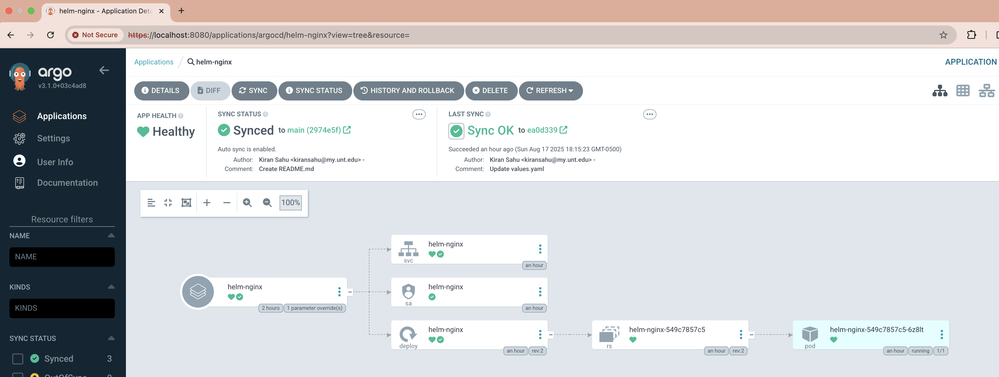
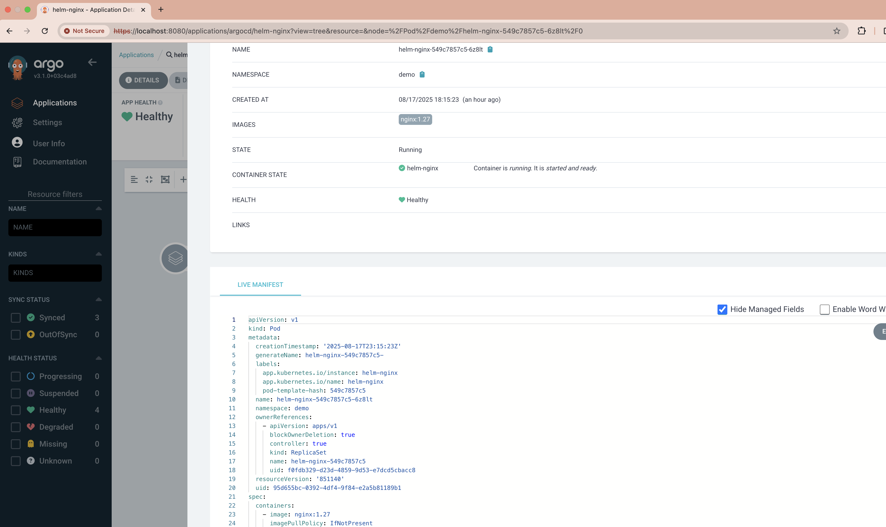

# Argo CD + Helm Nginx Demo (with Minikube)
This repository shows how to deploy a simple **Nginx application** on Kubernetes using **Helm** and manage it with **Argo CD** (GitOps workflow).

---

## Prerequisites
Make sure you have these installed locally:
- [Docker](https://docs.docker.com/get-docker/) (or another container runtime)
- [kubectl](https://kubernetes.io/docs/tasks/tools/) (v1.27+)
- [Minikube](https://minikube.sigs.k8s.io/docs/start/) (v1.33+)
- [Helm](https://helm.sh/docs/intro/install/) (v3)

---

## Step 1: Start Minikube
```bash
minikube start --cpus=4 --memory=8192 --driver=docker
kubectl cluster-info
kubectl get nodes
```` 
---

## Step 2: Install Argo CD
```bash
kubectl create namespace argocd
kubectl apply -n argocd \
  -f https://raw.githubusercontent.com/argoproj/argo-cd/stable/manifests/install.yaml

kubectl -n argocd rollout status deploy/argocd-server
kubectl -n argocd get pods
````
Port forwarded to access the Argocd app
```bash
kubectl -n argocd port-forward svc/argocd-server 8080:443
````
Open UI → https://localhost:8080

Credentials: 
```bash
Username: admin
Password: ********
````

Note: you can get the password using below command

```bash
kubectl -n argocd get secret argocd-initial-admin-secret \
  -o jsonpath="{.data.password}" | base64 -d; echo
````
---
## Step 3: Create a Helm Chart 
For test I picked to create nginx, you can use any.

Generate a new chart:
```bash
helm create helm-nginx
````

Edit helm-nginx/values.yaml:
```yaml
image:
  repository: nginx
  tag: "1.27"
  pullPolicy: IfNotPresent

service:
  type: ClusterIP
  port: 80

ingress:
  enabled: false

resources:
  requests:
    cpu: 50m
    memory: 64Mi
  limits:
    cpu: 100m
    memory: 128Mi

replicaCount: 1
serviceAccount:
  create: true
  name: ""
  annotations: {}

autoscaling:
  enabled: false 
````

Push repo to GitHub/GHE:
```bash
git init
git add .
git commit -m "Initial Helm Nginx chart"
git branch -M main
git remote add origin https://github.com/krun02/argocd.git ## update it with your repo
git push -u origin main

````
---
## Step 4: Create an Argo CD Project and App

Created the Project, project-nginx.yaml 
```yaml
apiVersion: argoproj.io/v1alpha1
kind: AppProject
metadata:
  name: demo
  namespace: argocd
spec:
  description: Demo project for Helm nginx
  sourceRepos:
    - https://github.com/krun02/argocd.git
  destinations:
    - namespace: demo
      server: https://kubernetes.default.svc
  clusterResourceWhitelist:
    - group: '*'
      kind: '*'
  namespaceResourceWhitelist:
    - group: '*'
      kind: '*'
```

Apply the project:
```bash
kubectl apply -f project-nginx.yaml
```

Create the App, app-nginx.yaml
```yaml
apiVersion: argoproj.io/v1alpha1
kind: Application
metadata:
  name: helm-nginx
  namespace: argocd
spec:
  project: demo                  # make sure this AppProject exists; use "default" otherwise
  source:
    repoURL: https://github.com/krun02/argocd.git
    targetRevision: main
    path: .                      # chart lives at repo root
    helm:
      valueFiles:
        - values.yaml
      parameters:
        - name: image.tag
          value: "1.27"
  destination:
    server: https://kubernetes.default.svc
    namespace: demo
  syncPolicy:
    automated:
      prune: true
      selfHeal: true
    syncOptions:
      - CreateNamespace=true
```
Apply the project:
```bash
kubectl apply -f app-nginx.yaml
```

---
## Step 5: Verify the App
```bash
kubectl -n demo get deploy,svc,cm,pods
```
Open UI → https://localhost:8080






